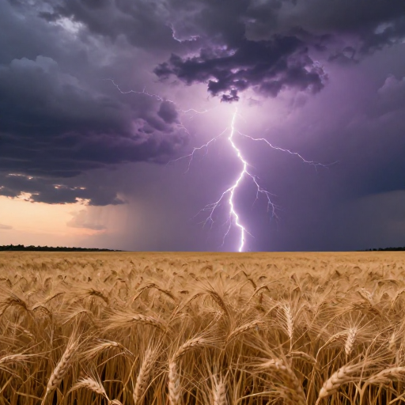
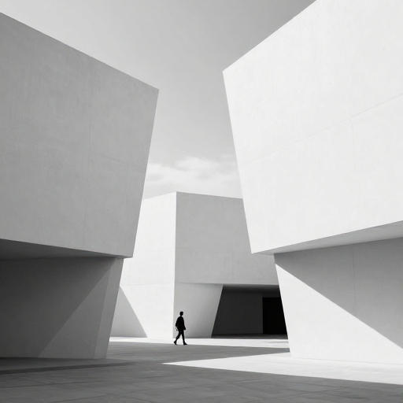
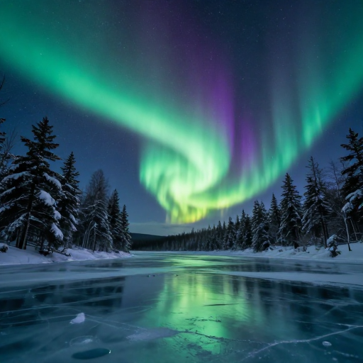
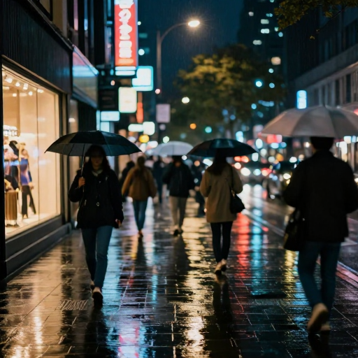
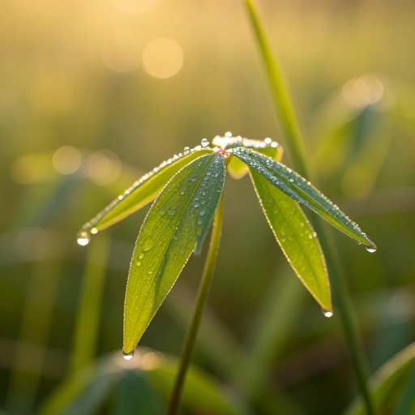
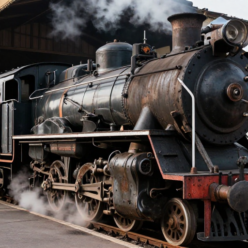
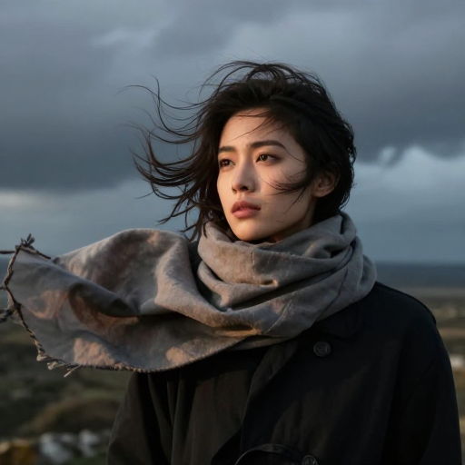
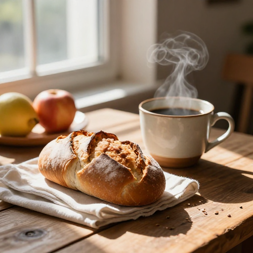
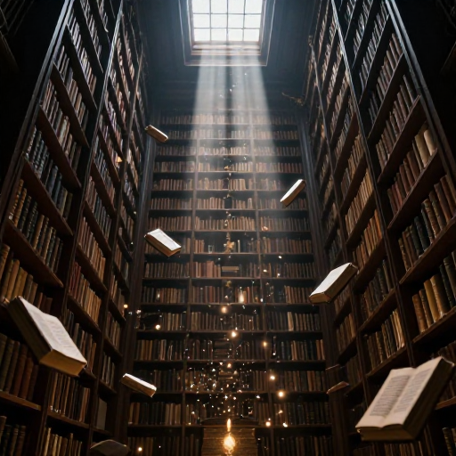

# Z-Image-Turbo Extended Visual Results

This section displays all generated images from Z-Image-Turbo with their corresponding prompts for visual comparison. These images showcase the model's capabilities across diverse photographic styles and scenarios.

## Image Gallery

### Image 1: Underwater Scene with Complex Lighting
**Prompt:** Underwater coral reef scene with sunlight streaming from above, creating dramatic light rays through the water. Schools of tropical fish swimming between colorful corals and sea anemones. Crystal clear turquoise water with natural depth and refraction effects.

### Image 2: Dynamic Weather and Atmospheric Effects
**Prompt:** Storm clouds gathering over a wheat field at dusk. Lightning illuminating dark purple and grey clouds from within. Golden wheat swaying in strong wind, dramatic contrast between warm foreground and ominous sky. Wide cinematic landscape.

### Image 3: Abstract Architectural Photography
**Prompt:** Modern minimalist architecture, geometric concrete structures with sharp angles and clean lines. Interplay of light and shadow on white surfaces. Single figure for scale walking through the space. High contrast black and white photography style.

### Image 4: Natural Phenomena
**Prompt:** Aurora borealis dancing over a frozen lake surrounded by snow-covered pine forest. Green and purple lights reflecting on ice surface. Stars visible in clear night sky. Long exposure photography capturing light movement.

### Image 5: Urban Street Photography at Night
**Prompt:** Busy city street at night after rain, wet pavement reflecting neon signs and streetlights. Blurred motion of people with umbrellas walking past illuminated shop windows. Bokeh lights in background, moody cinematic atmosphere.

### Image 6: Macro Nature Photography
**Prompt:** Morning dewdrops on fresh green leaves backlit by golden sunrise. Each droplet catching and refracting light. Shallow depth of field with soft bokeh background. Delicate plant details visible, vibrant natural colors.

### Image 7: Industrial and Mechanical Subjects
**Prompt:** Vintage steam locomotive at an old railway station, dramatic side lighting highlighting mechanical details. Steam rising from the engine, rust and weathered metal textures. Sense of history and craftsmanship, documentary photography style.

### Image 8: Dramatic Portraiture with Elements
**Prompt:** Portrait of a person with windswept hair against stormy sky backdrop. Fabric or scarf billowing dramatically in wind. Intense natural lighting from the side, raw emotion captured. Environmental portrait connecting subject to nature.

### Image 9: Food Photography with Styling
**Prompt:** Rustic breakfast scene on wooden table by window. Fresh bread, fruits, coffee in ceramic cup, natural morning light casting soft shadows. Steam rising from hot beverage, appetizing composition with natural textures and warm tones.

### Image 10: Fantasy Realism
**Prompt:** Ancient library with towering bookshelves reaching into darkness above. Floating books and glowing magical particles in the air. Single beam of light from high window illuminating dust motes. Mysterious and enchanting atmosphere, photorealistic rendering.

## Summary

All Z-Image-Turbo generated images are stored in the `Z-Image-Turbo-outputs-png/` directory. The images above demonstrate the model's capabilities across diverse photographic styles and scenarios:

- **Underwater scenes** with complex lighting and refraction
- **Weather and atmospheric effects** with dramatic contrasts
- **Architectural photography** with geometric precision
- **Natural phenomena** like aurora borealis
- **Urban night photography** with reflections and motion
- **Macro photography** with shallow depth of field
- **Industrial subjects** with texture and detail
- **Portraiture** with environmental context
- **Food photography** with natural styling
- **Fantasy realism** blending magic with photorealism

Each image was generated using Z-Image-Turbo with the prompts listed above, showcasing the model's versatility in handling different photographic styles and complex scene compositions.
